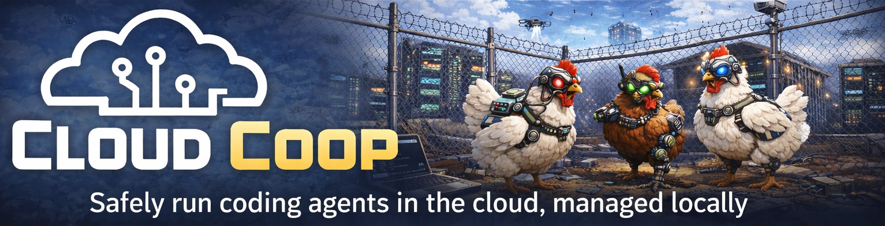

# cloudcoop

<p align="center">
  
</p>

[](https://github.com/cloud-coop/cloudcoop/actions/workflows/test.yml)
[](https://codecov.io/gh/cloud-coop/cloudcoop)
[](https://goreportcard.com/report/github.com/cloud-coop/cloudcoop)

A terminal UI for managing sandboxed AI coding agents on cloud VMs.

## Overview

cloudcoop provisions and manages cloud VMs configured as secure sandboxes for running multiple AI
coding agents (Claude Code, Aider, Gemini CLI, etc.). Each agent runs in its own tmux session with
full development tooling.

**Key features:**

- TUI for VM lifecycle management (start, stop)
- Agent-agnostic: supports Claude Code, Aider, Gemini CLI, and others
- Cloud-agnostic: GCP first, AWS and Azure planned
- Automatic IP-based firewall rules (optional)
- Cost-optimized: spot instances, stop when idle

## Architecture

```text
┌─────────────────────────────────────────────────────────────────┐
│  Your Workstation                                               │
│  ┌───────────────────────────────────────────────────────────┐  │
│  │  cloudcoop TUI                                            │  │
│  │  • VM status, start/stop                                   │  │
│  │  • Agent session management                               │  │
│  │  • IP-based firewall updates                              │  │
│  └───────────────────────────────────────────────────────────┘  │
└─────────────────────────────────┬───────────────────────────────┘
                                  │ SSH + Cloud SDK
                                  ▼
┌─────────────────────────────────────────────────────────────────┐
│  Cloud VM (GCP/AWS/Azure)                                       │
│  c4a-highcpu-16 (ARM) · 50GB SSD · Spot instance               │
│                                                                 │
│  ┌───────────────────────────────────────────────────────────┐  │
│  │  tmux: agents                                             │  │
│  │  ┌─────────┐ ┌─────────┐ ┌─────────┐     ┌─────────┐     │  │
│  │  │ agent-1 │ │ agent-2 │ │ agent-3 │ ... │agent-12 │     │  │
│  │  │ claude  │ │ claude  │ │  aider  │     │ claude  │     │  │
│  │  └─────────┘ └─────────┘ └─────────┘     └─────────┘     │  │
│  └───────────────────────────────────────────────────────────┘  │
│                                                                 │
│  Shared: Docker · Dev tooling · Git credentials                 │
│  Service account: Minimal GCP permissions                       │
└─────────────────────────────────────────────────────────────────┘
```

## Quick Start

```bash
# Download latest release
curl -fsSL https://github.com/yourorg/cloudcoop/releases/latest/download/cloudcoop-$(uname -s)-$(uname -m) -o cloudcoop
chmod +x cloudcoop

# Run setup wizard to configure
./cloudcoop config init

# Launch TUI
./cloudcoop

# Or check status via CLI
./cloudcoop status
```

## Development

```bash
# Clone and build
git clone https://github.com/cloud-coop/cloudcoop.git
cd cloudcoop
make build

# Run
./bin/cloudcoop version
./bin/cloudcoop status
./bin/cloudcoop  # Launch TUI

# Development commands
make test           # Run tests
make lint           # Run linter
make test-coverage  # Coverage report
make help           # All targets
```

See [CONTRIBUTING.md](CONTRIBUTING.md) for development setup details.

## TUI Interface

```text
┌─────────────────────────────────────────────────────────────────┐
│  cloudcoop                                           v0.1.0     │
├─────────────────────────────────────────────────────────────────┤
│  Cloud: GCP (europe-north2-a)                                   │
│  VM: claude-sandbox          ● Running                          │
│  Type: c4a-highcpu-16        Cost: ~$0.12/hr (spot)            │
│  IP Firewall: ✓ 203.0.113.42/32                                │
│                                                                 │
│  Agents (8 active)                                              │
│  [1] agent-1   claude   ● issue-142       2h 30m               │
│  [2] agent-2   claude   ● issue-143       2h 28m               │
│  [3] agent-3   aider    ● quick-fix       0h 45m               │
│  [4] agent-4   claude   ○ idle            -                    │
│                                                                 │
├─────────────────────────────────────────────────────────────────┤
│  [S]tart  s[T]op  [A]dd  [K]ill  [C]onnect  [r]efresh  [Q]uit  │
└─────────────────────────────────────────────────────────────────┘
```

## Configuration

Configuration is stored at `~/.config/cloudcoop/cloudcoop.toml`.

```bash
# Create config with setup wizard
cloudcoop config init

# View current configuration
cloudcoop config show

# Update a specific value
cloudcoop config set cloud.gcp.project my-project
cloudcoop config set cloud.gcp.zone us-central1-a
cloudcoop config set vm.name claude-sandbox
```

```toml
# ~/.config/cloudcoop/cloudcoop.toml

[cloud]
provider = "gcp"

[cloud.gcp]
project = "my-project"
zone = "us-central1-a"

[vm]
name = "claude-sandbox"

[ssh]
port = 22                    # SSH port (default: 22)
# user = "ubuntu"            # SSH username (default: current user)

[agents]
# default_command = "claude --dangerously-skip-permissions"
```

### Available Configuration Keys

| Key | Description | Default |
|-----|-------------|---------|
| `cloud.provider` | Cloud provider (gcp, aws, azure) | gcp |
| `cloud.gcp.project` | GCP project ID | (required) |
| `cloud.gcp.zone` | GCP zone | (required) |
| `vm.name` | VM instance name | (required) |
| `ssh.port` | SSH port | 22 |
| `ssh.user` | SSH username | current user |
| `agents.default_command` | Default command for new agents | (none) |

## Agent Support

| Agent | Autonomous Mode | Session Persistence |
|-------|-----------------|---------------------|
| Claude Code | `--dangerously-skip-permissions` | `--continue`, `--resume` |
| Aider | `--yes-always` | Stateless |
| Gemini CLI | TBD | TBD |
| GitHub Copilot | Limited | OAuth-based |

## Cost

For c4a-highcpu-16 in europe-north2 (Stockholm):

| Usage | Monthly Cost |
|-------|-------------|
| Spot 24/7 | ~$85 |
| Spot 8h/day | ~$30 |
| Stopped (disk only) | ~$5 |

## Documentation

- [Architecture Decisions](decisions/README.md) - ADRs explaining design choices
- [TUI Requirements](docs/TUI-REQUIREMENTS.md) - Detailed TUI specification
- [Development Environment](docs/DEVELOPMENT-ENVIRONMENT.md) - Contributing guide
- [Setup Flow](docs/SETUP-FLOW.md) - First-run experience

## License

Apache 2.0
